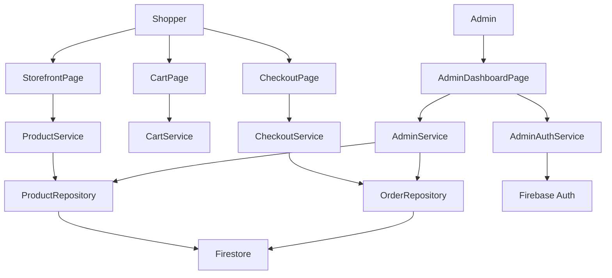
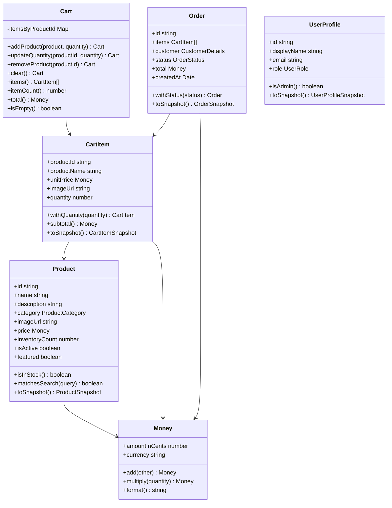
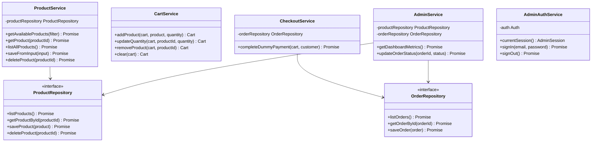
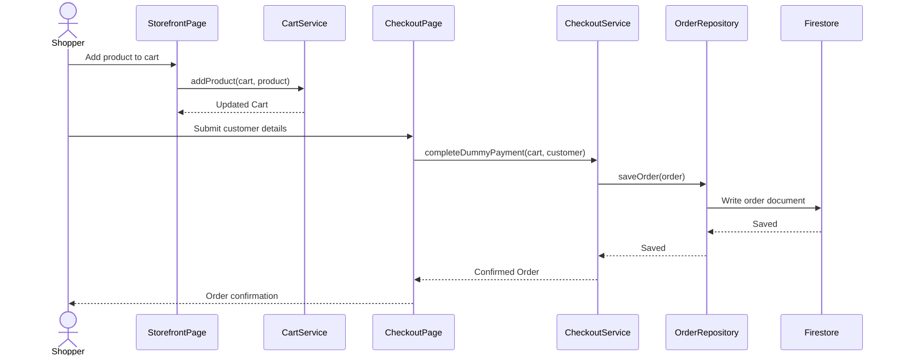
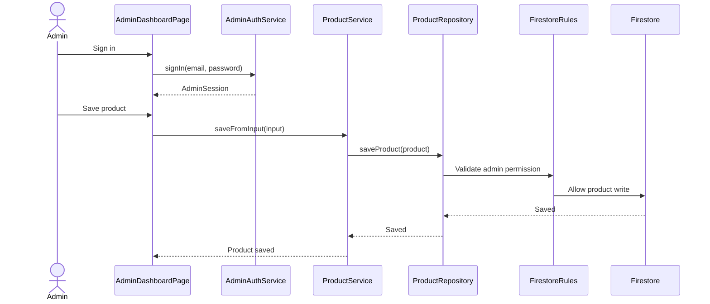
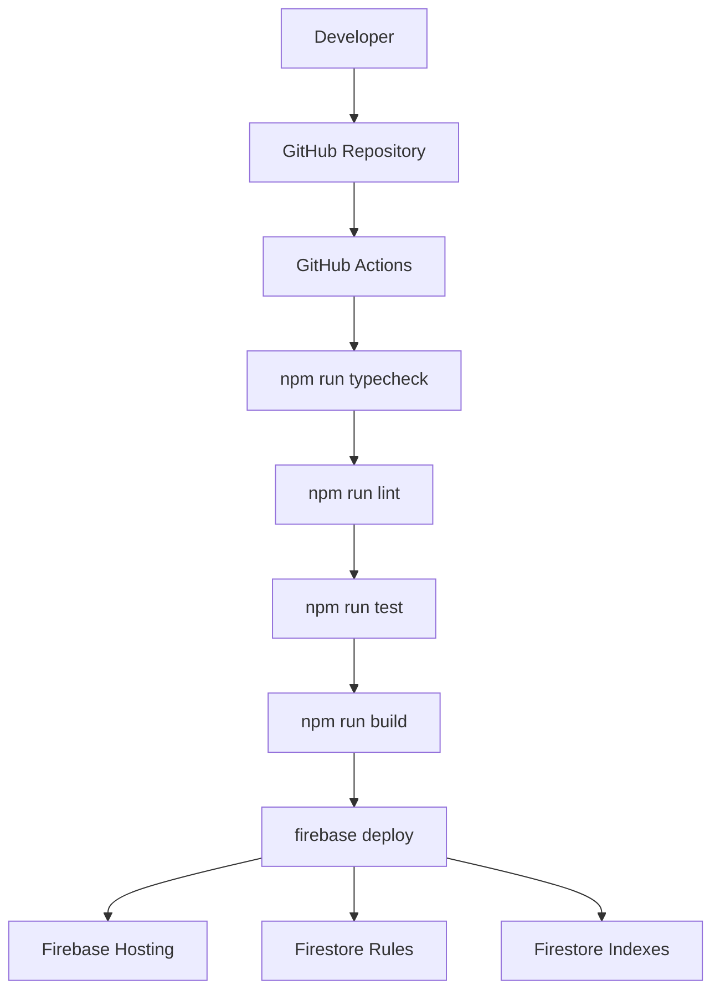
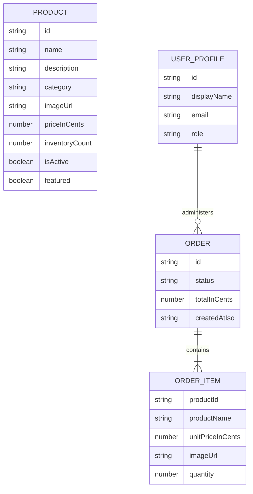

# Design Document

This document records the main design choices and UML diagrams for the CS491 e-commerce web app. The implementation is TypeScript-first and object-oriented, with React used as the UI layer.

## Design Goals

- Keep business logic out of React components.
- Use strict TypeScript with no implicit or explicit `any`.
- Model the domain with classes so behavior is close to the data it protects.
- Use repositories to isolate persistence from application logic.
- Make deployment reproducible through committed Firebase and GitHub Actions config.
- Keep the app usable in local demo mode without Firebase credentials.

## High-Level Architecture

## Class Diagram

## Service And Repository Diagram

## Checkout Sequence

## Admin Product Management Sequence

## Firebase Deployment Flow

## Data Model

## Design Choices

### Object-Oriented Domain Model

The core shopping behavior is implemented with domain classes. `Cart` owns cart changes and totals, `Order` owns order creation/status snapshots, and `Money` owns currency-safe arithmetic. This keeps business rules testable without rendering React components.

### Repository Pattern

Services depend on `ProductRepository` and `OrderRepository` interfaces instead of Firebase directly. This allows two runtime modes:

- Local demo mode through `InMemoryProductRepository` and `InMemoryOrderRepository`.
- Firebase-backed mode through `FirestoreProductRepository` and `FirestoreOrderRepository`.

### React As UI Layer

React components handle rendering, inputs, routing, and event handling. Business actions are delegated to service classes. This keeps pages readable and makes UML diagrams match the implementation.

### Firebase-Only Deployment

Firebase Hosting, Firestore rules, Firestore indexes, environment placeholders, seed script, and GitHub Actions deployment are committed to the repository. The only manual setup is project creation, enabling Firebase services, and adding secrets.

### Dummy Payment

The checkout intentionally avoids real payment APIs. `CheckoutService.completeDummyPayment` creates a paid order after customer details are submitted. This satisfies the course project requirement without introducing PCI/security risk.

### AI Feature Without Paid API Dependency

`AiShoppingAssistant` provides a simple recommendation message from current catalog data. It demonstrates an AI-style feature while keeping the core application functional without external AI credentials.

## Testing Strategy

- `Cart.test.ts`: verifies cart item counts, quantity updates, and totals.
- `CheckoutService.test.ts`: verifies dummy checkout creates a paid order through the repository interface.
- `InMemoryProductRepository.test.ts`: verifies repository save/read behavior with typed `Product` objects.

Future tests should cover Firestore snapshot mapping, admin status changes, product validation errors, and UI workflows with React Testing Library.